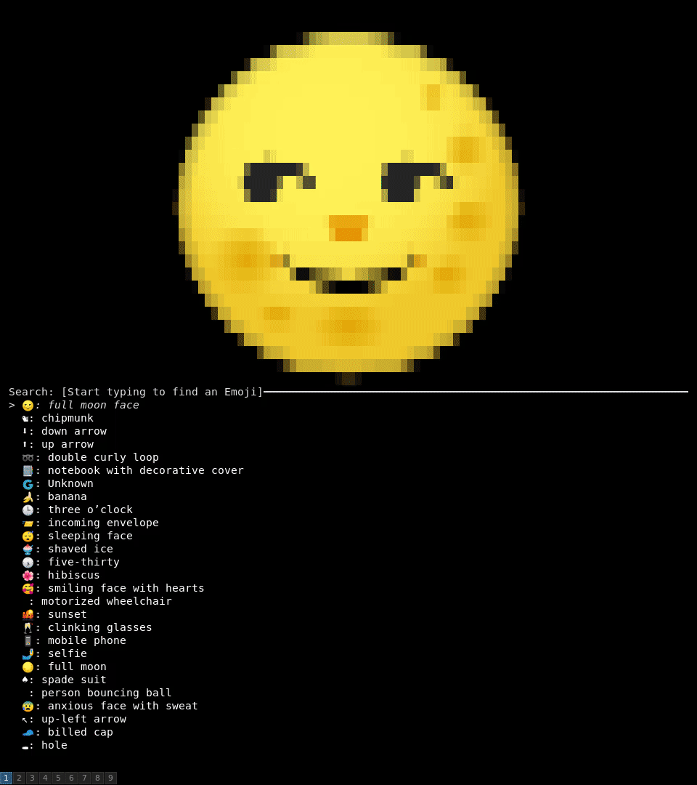

# Emojifinder

The fuzzy searching terminal based Emoji finder you've always needed.

* [Installation](#Installation)
* [Building](#Building)
* [License](#License)

# Installation

`cargo install emojifinder`

# Building

This repo is a Cargo workspace containing two binary crates and a third providing a common core.

* _builder_ creates an index which is serialised and compressed to `finder/data/index.bin`
* _finder_ is the frontend program run by the end user

To rebuild the index you'll need to fetch the submodules for the SVGs and annotations data:

`git submodule update --init --recursive`

You can then build the index:

`cargo run -p emojifinder-builder`

and eventually the frontend:

`cargo run --release`

# License

_Emojifinder_ is open source software, distributed under the [MIT license](LICENSE.md)).

This application contains:
* SVG assets from the [NotoColorEmoji](https://github.com/googlefonts/noto-emoji) font (copyright Google Inc.) distributed under the [Apache License, Version 2.0](https://github.com/googlefonts/noto-emoji/blob/master/LICENSE).
* Annotations from the [Unicode Common Locale Data Repository](https://github.com/unicode-org/cldr) (copyright Unicode, Inc) distributed under the [Unicode Terms of Use](https://www.unicode.org/copyright.html).
